# MWA Demo

Demonstration pipeline for Murchison Widefield Array (MWA) data

## Flow

```mermaid
flowchart TD;
classDef in fill:#2aa198;
classDef out fill:#d33682;
classDef file fill:#268bd2;
classDef proc fill:#b58900;
classDef decision fill:#cb4b16;

subgraph s01["01 TAP"]
  mwaTap([ MWA TAP ]); class mwaTap in;
  obsids[/" obsids.csv "/]; class obsids file;
  mwaTap --> obsids;
end

subgraph s02["02 Download"]
  mwaAsvo([ MWA ASVO]); class mwaAsvo in;
  giant-squid[[ giant-squid ]]; class giant-squid proc;
  raw[/ raw data /]; class raw file;
  metafits[/ metafits /]; class metafits file;
  obsids --> giant-squid --> mwaAsvo --> raw & metafits;
end

subgraph s03["03 MWALib"]
  mwalib[[ MWALib]]; class mwalib proc;
  mwalibOut[/ antennas and channels /]; class mwalibOut file;
  %% channels[/ channels.csv/]; class channels file;
  metafits --> mwalib --> mwalibOut;
end

subgraph s04["04 SSINS"]
  ssins[[ SSINS]]; class ssins proc;
  flags[/ flag plots/]; class flags file;
  raw & metafits --> ssins --> flags;
end

s02 -.....->|raw| s05

subgraph s05["05 Preprocess"]
  birli[[ Birli ]]; class birli proc;
  prepUVFits[/ preprocessed uvfits /]; class prepUVFits file;
  prepQA[[ prepQA]]; class prepQA proc;
  prepQAJson[/ prepQA json /]; class prepQAJson file;
  %% local copy of metafits and raw to simplify graph
  metafits05[/ metafits /]; class metafits05 file;
  raw05[/ raw data /]; class raw05 file;

  metafits05 & raw05 --> birli --> prepUVFits;
  metafits05 & prepUVFits --> prepQA --> prepQAJson;
end

subgraph s06["06 calibrate"]
  hypCalSol[[ hyperdrive di-cal]]; class hypCalSol proc
  calSol[/ cal solutions/]; class calSol file
  prepUVFits[/ prep uvfits/]; class prepUVFits file
  calQA[[ calQA]]; class calQA proc;
  calQAJson[/" calqa.json "/]; class calQAJson file
  plotSolutions[[ hyperdrive solutions-plot]]; class plotSolutions proc
  plotSol[/" solution plots "/]; class plotSol file
  hypApply[[ hyperdrive solutions-apply ]]; class hypApply proc
  calMS[/ calibrated CASA Measurement Set /]; class calMS file
  %% local copy of metafits to simplify graph
  metafits06[/ metafits /]; class metafits06 file;

  metafits06 --> hypCalSol
  prepUVFits -----> hypCalSol --> calSol
  metafits06 & calSol --> calQA --> calQAJson
  metafits06 & calSol --> plotSolutions --> plotSol

  calQAJson -.->|bad antennas| hypApply
  calSol & prepUVFits --> hypApply --> calMS
end

subgraph s07["07 image"]
  imgDConv[/" *-image.fits "/]; class imgDConv file
  imgPB[/" *-image-pb.fits "/]; class imgPB file
  wscleanDConv[[ wsclean ]]; class wscleanDConv proc
  %% imgMetricsJson[/ img_metrics.json /]; class imgMetricsJson file
  %% imgQA[[ imgQA ]]; class imgQA proc;
  calMS --> wscleanDConv --> imgDConv & imgPB
  %% --> imgQA --> imgMetricsJson
end

subgraph s08["08 postimage"]
  bane[[ BANE ]]; class bane proc
  imgPBRMS[/" *-image-pb_rms.fits "/]; class imgPBRMS file
  imgPBBkg[/" *-image-pb_bkg.fits "/]; class imgPBBkg file
  aegean[[ aegean ]]; class aegean proc
  imgPBComp[/" *-image-pb_comp.fits "/]; class imgPBComp file
  imgPB --> bane --> imgPBRMS & imgPBBkg
  imgPBRMS & imgPBBkg --> aegean --> imgPBComp
end
```

## Setup

This demo requires some software and data to be available on your machine.

Please read the [setup instructions](SETUP.md) carefully.

## Downloads

Each workshop in the demo uses different data sets. You can refer to the start of the workshop instructions for how to download that data, or download it yourself with `demo/01_download.sh` if you have an ASVO account.

## Workshops

This demo is made of modular components that can be completed independently.

### Part 1: Configurations

Starting with nothing but some raw correlator files, you'll preprocess, calibrate and image Centaurus A in three MWA Configurations, exploring how uv-coverage impacts the point spread function and images.

[WORKSHOP_01.md](WORKSHOP_01.md)

### Part 2: Radio Oddities

We'll take a closer look at one of the observations from part 1 using SSINS to look for RFI, and explore some additional oddities in other data sets.

[WORKSHOP_02.md](WORKSHOP_02.md)

### Part 3: Calibration

We'll explore the nuances of calibration.

[WORKSHOP_03.md](WORKSHOP_03.md)
