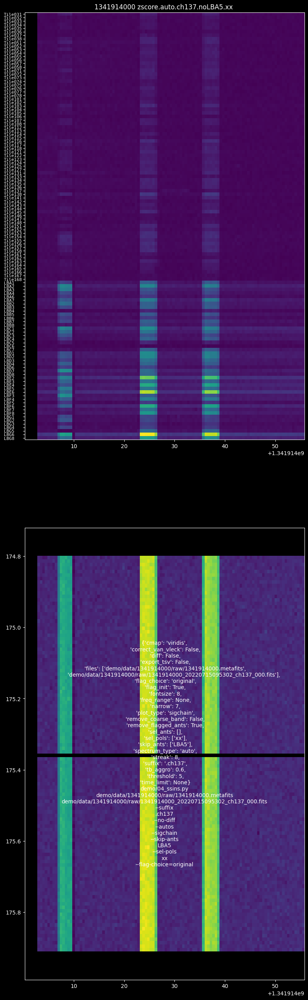
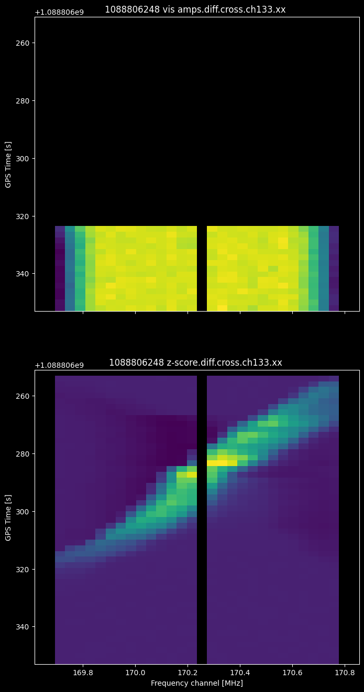
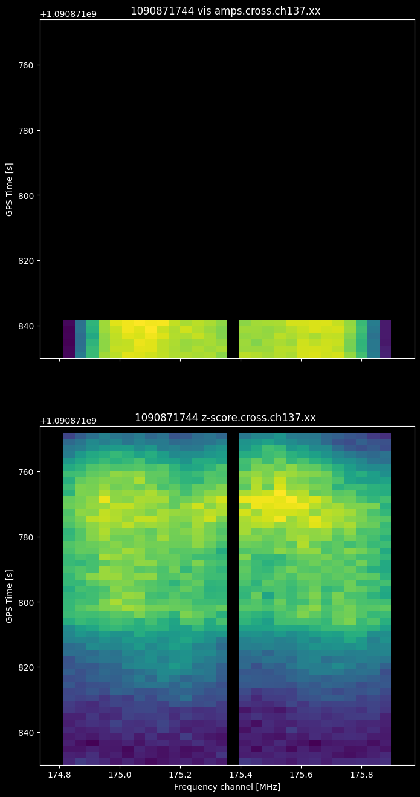
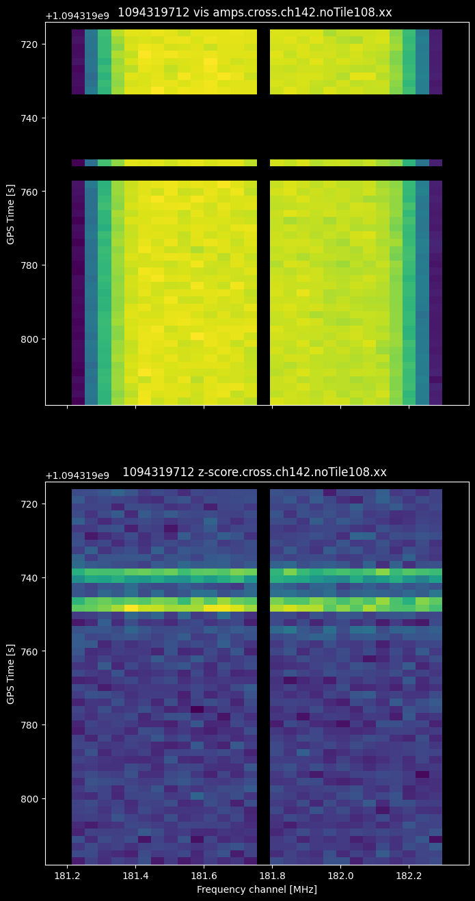
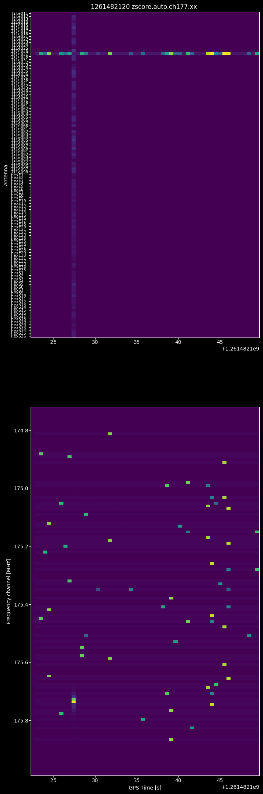
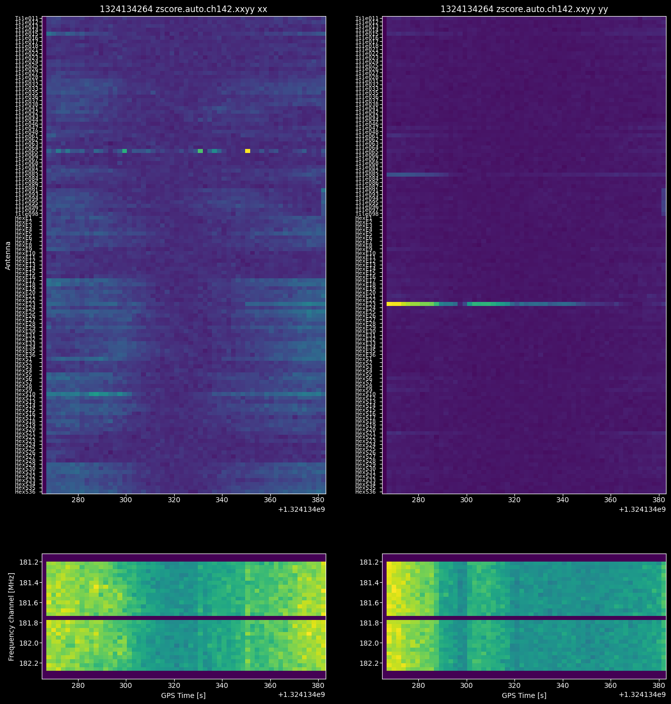
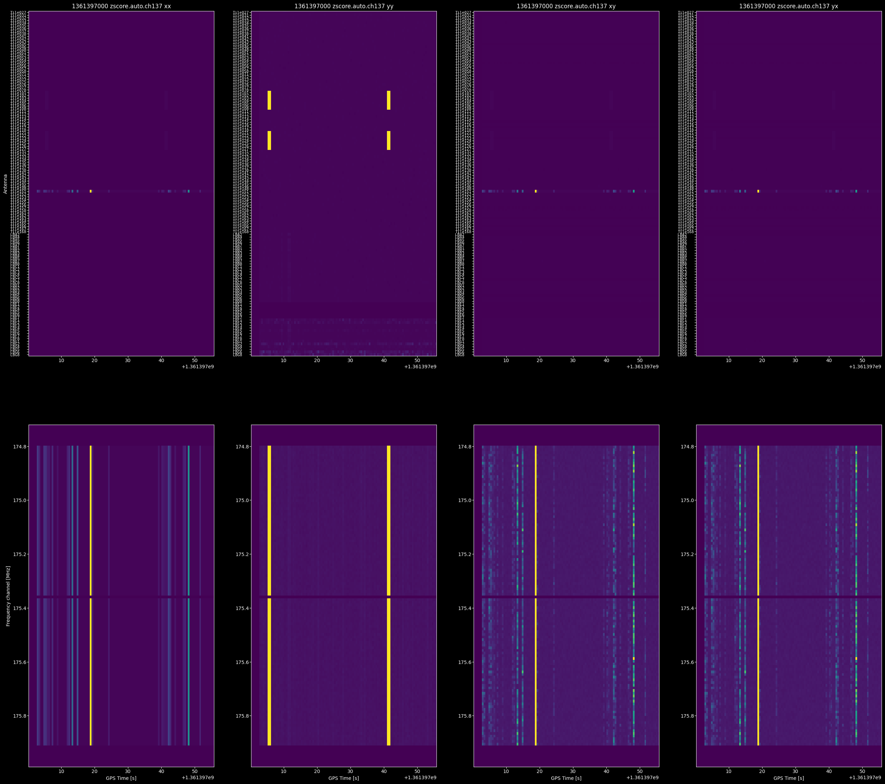

# MWA Demo

Demonstration pipeline for Murchison Widefield Array (MWA) data

## Flow


## System Requirements

This demo runs best on a linux amd64 (x86_64) machine with at least:

- 16GB of RAM
- 20GB free disk space

macOS amd64 (Intel) and arm64 (M-Series) will work, but CPU-only.

Windows users will need to use WSL2 or Docker Desktop with Git Bash.

## Setup

Clone this repository to a machine that meets the [system requirements](#system-requirements).

```bash
git clone https://github.com/MWATelescope/mwa-demo.git
cd mwa-demo
```

If you originally cloned this repository days before the workshop, it's a good idea
to check for updates right before the workshop starts with a `git pull`.

## Downloads

Download demo data (from Pawsey). You should be in the root of the repository.

```bash
mkdir -p demo/data/1121334536/raw
curl -L -o demo/data/1121334536/raw/1121334536_20150719094841_gpubox20_00.fits 'https://projects.pawsey.org.au/mwa-demo/1121334536_20150719094841_gpubox20_00.fits'
mkdir -p demo/data/1303134032/raw
curl -L -o demo/data/1303134032/raw/1303134032_20210422134116_gpubox20_01.fits 'https://projects.pawsey.org.au/mwa-demo/1303134032_20210422134116_gpubox20_01.fits'
mkdir -p demo/data/1341914000/raw
curl -L -o demo/data/1341914000/raw/1341914000_20220715095302_ch137_000.fits 'https://projects.pawsey.org.au/mwa-demo/1341914000_20220715095302_ch137_000.fits'
```

Alternatively , you can download the same demo data in your browser [here](https://curtin-my.sharepoint.com/:u:/g/personal/285446d_curtin_edu_au/EQF1Dl93KixAimsD7wi7TcYBjAUs7Y6LO08An5rKSB2cmg?e=nMtGhu) and extract it to the `demo/data` directory.

```bash
unzip -n demo2.zip # -n = do not replace pre-existing files
```

## Software dependencies

There are several ways that you can provide the software dependencies to run this demo:

- docker: run the software in a Docker container (**recommended for new users!**)
- bare metal: install everything to your local machine (best for performance)
- hybrid: use a mix of Docker and local software (good balance)
- singularity: similar to Docker, but for shared HPC environments

The scripts in this demo are designed to be run from a Bash shell, with all
binaries available in `$PATH`.

When your software environment is ready, you can test it by running `demo/00_test.sh`

### Windows

Some dependencies like casacore simply do not work on Windows, so you will need to use Docker or WSL.
The scripts are written for a Bash shell, and won't work in PowerShell or CMD.

The demo has been tested on Windows 11 with Docker Desktop 4.33.1 on a Git Bash shell.

Some Windows users with 8GB of RAM have reported that the demo runs out of memory
running Docker withing WSL. It may be necessary to change

### Docker

A cross-platform, cpu-only [`Dockerfile`](Dockerfile) is provided which encapsulates all software
dependencies.

For maximum portability, generic Docker images have been built for the `linux/amd64` and
`linux/arm64` platforms, however neither take full advantage of the hardware acceleration
available on your machine. For maximum performance, you should follow the [bare metal](#bare-metal)
instructions.

[Windows](https://docs.docker.com/desktop/install/windows-install/) and
[macOS](https://docs.docker.com/desktop/install/mac-install/) users should install Docker Desktop.

Linux users should Carefully follow these [instructions](https://docs.docker.com/engine/install/)
to install Docker Engine. Debian and Ubuntu users may be tempted to install `docker` via snap, but
this is not recommended. I personally use the unofficial `docker.io` package available on apt.

Linux users should also ensure they have permissions to run docker without root:
`sudo usermod -aG docker $USER`

quick start: pull the images from dockerhub.

```bash
docker pull mwatelescope/mwa-demo:latest
```

When [running the demo](#running-the-demo), you should run the commands in an interactive Docker shell.

```bash
docker run -it --rm -v ${PWD}:${PWD} -w ${PWD} -e MWA_ASVO_API_KEY=$MWA_ASVO_API_KEY mwatelescope/mwa-demo:latest
```

#### Docker Troubleshooting

macOS users: if you see this error: `WARNING: The requested image's platform (linux/amd64) does not match the detected host platform (linux/arm64/v8) and no specific platform was requested`, you should pull the image for the correct platform.

```bash
docker pull --platform linux/arm64 mwatelescope/mwa-demo:latest
```

If you have any issues, you should delete all traces of the image that was pulled and build the image locally. (this may take a while)

```bash
# first remove the image that was pulled from dockerhub
docker rmi mwatelescope/mwa-demo:latest
docker builder prune --all
docker buildx prune --all
docker build -t mwatelescope/mwa-demo:latest -f Dockerfile .
```

### Bare Metal

<details>
  <summary>For advanced users</summary>

For optimal performance, you should compile the following software dependencies directly on your
machine.

Advanced users can provide additional compiler flags during the build process to optimize for their specific CPU micro-architecture. e.g. `-march=native` for C/C++, or `-C target-cpu=native` for Rust.

The steps in the `Dockerfile` may be a useful guide.

- python 3.8+ <https://www.python.org/downloads/>
  - pyvo <https://pyvo.readthedocs.io/en/latest/#installation>
  - mwalib <https://github.com/MWATelescope/mwalib/wiki/Installation%3A-Python-Users>
  - ssins <https://github.com/mwilensky768/SSINS#installation>
  - mwa_qa `git clone https://github.com/d3v-null/mwa_qa.git ; pip install .`
- jq <https://jqlang.github.io/jq/download/>
- AOFlagger <https://aoflagger.readthedocs.io/en/latest/installation.html>
- wsclean <https://wsclean.readthedocs.io/en/latest/installation.html>
  - recommended: EveryBeam <https://everybeam.readthedocs.io/en/latest/build-instructions.html>
  - recommended: IDG <https://idg.readthedocs.io/en/latest/build-instructions.html>
- rust <https://www.rust-lang.org/tools/install>
  - giant-squid <https://github.com/MWATelescope/giant-squid#installation>
  - Birli <https://github.com/MWATelescope/Birli#installation>
  - hyperdrive <https://mwatelescope.github.io/mwa_hyperdrive/installation/intro.html>

</details>

### Hybrid

<details>
  <summary>For advanced users</summary>

If you have some software dependencies installed locally, you can use Docker to run the rest.

This will create fake binaries in the `./bin` directory that just call Docker for any missing commands.

```bash
demo/00_hybrid.sh
export PATH=${PATH}:./bin/
```

This is probably bad practice for a production pipeline!

</details>

### Singularity

<details>
  <summary>For advanced users</summary>

Most HPC environments don't allow you to run Docker (for security reasons).
You can however run Docker images in Singularity.

```bash
singularity exec -B$PWD -W$PWD --cleanenv docker://mwatelescope/mwa-demo:latest /bin/bash
```

</details>

## ASVO account

Please register for an ASVO account: [asvo.mwatelescope.org/registration](https://asvo.mwatelescope.org/registration)
Visibility data is made public 18 months after observation. For any support
enquiries, please email <asvo_support@mwatelescope.org>

Once you have your ASVO account, log in to <https://asvo.mwatelescope.org/profile>
to obtain your API key and set it as an environment variable:

```bash
export MWA_ASVO_API_KEY="..."
```

Detailed instructions here: <https://mwatelescope.atlassian.net/wiki/spaces/MP/pages/24972779/MWA+ASVO+Command+Line+Clients#Finding-your-API-key>

you may want to add this to your `~/.bashrc` to persist it
across sessions, but remember to keep this key secret!

## Pre-workshop tests

The last step before the workshop is to check that everything is working.

```bash
demo/00_test.sh
```

Please ensure that:

- scripts are run from the root of the repository (don't `cd` into the `demo` directory).
- scripts are not sourced, and are run directly.
- (if [Docker](#docker)) you are in a Docker shell, not your host system.
- (if [hybrid](#hybrid)), you have run `demo/00_hybrid.sh` and `export PATH=${PATH}:${PWD}/bin/`
- (if [singularity](#singularity)), you are in a Singularity shell, `singularity exec -B$PWD -W$PWD --cleanenv docker://mwatelescope/mwa-demo:latest /bin/bash`

## Running the demo

You are now ready to follow along with the workshop.

### Part 1: First pass

```bash
# (optional) pick a specific obsid:
export obsid=1121334536 # Phase I
export obsid=1303134032 # Phase II Compact
export obsid=1341914000 # Phase II Extended

# query the MWA TAP server with ADQL using the pyvo library
clear; demo/01_tap.sh
# display giant-squid commands to download observations
clear; demo/02_download.sh
# mwalib read observation metadata
demo/03_mwalib.sh
# SSINS find RFI
demo/04_ssins.sh
# Birli preprocess raw files, quality analysis, write uvfits
demo/05_prep.sh
# hyperdrive direction independent calibrate, qa, apply solutions, write measurement set
demo/06_cal.sh
# wsclean cal_ms
demo/07_img.sh
# done
```

You can inspect the images produced in Carta

```bash
carta --top_level_folder . --host 127.0.0.1
```

### Quality Analysis

The images for `1341914000` look a bit weird, let's enable calqa flags and try again.


uncomment this line in `demo/06_cal.sh` to apply bad antennas and see how the image changes!

```bash
export cal_bad_ants=""
```

```bash
export obsid=1341914000
rm -rf $outdir/$obsid/{cal,img}
demo/07_img.sh
```

### SSINS

Did aoflagger really get all the RFI? you can inspect the raw, preprocessed and calibrated files.

```bash
export metafits=${outdir}/${obsid}/raw/${obsid}.metafits
export raw="$(ls -1 ${outdir}/${obsid}/raw/${obsid}*.fits)"
export prep_uvfits="${outdir}/${obsid}/prep/birli_${obsid}.uvfits"
export cal_ms="${outdir}/${obsid}/cal/hyp_cal_${obsid}.ms"
python demo/04_ssins.py $metafits $raw
python demo/04_ssins.py $prep_uvfits
python demo/04_ssins.py $cal_ms
```

#### `1341914000` - Multiple Issues

let's look at the z-scores for each antenna. To simplify the plot, we'll look at only the long baseline group A initially.

```bash
python demo/04_ssins.py demo/data/1341914000/raw/1341914000{.metafits,_20220715095302_ch137_000.fits} --suffix '.ch137.LBA' --no-diff --sigchain --no-flag-init --sel-ants LBA{1..8} --sel-pols xx
```


let's make a note to flag LBA5 for this observation and plot the others

```bash
python demo/04_ssins.py demo/data/1341914000/raw/1341914000{.metafits,_20220715095302_ch137_000.fits} --suffix '.ch137' --no-diff --sigchain --skip-ants LBA5 --sel-pols xx
```



Now we can see three broadband RFI events seen by almost all tiles.

Let's see if we can flag it by asking ssins to look at the autocorrelations

```bash
python demo/04_ssins.py demo/data/1341914000/raw/1341914000{.metafits,_20220715095302_ch137_000.fits} --suffix '.ch137' --skip-ants LBA5 --sel-pols yy
```


It found the start and end of the broadband stripes, but doesn't flag the middle. Let's try cross-correlations.

```bash
python demo/04_ssins.py demo/data/1341914000/raw/1341914000{.metafits,_20220715095302_ch137_000.fits} --suffix '.ch137' --crosses --skip-ants LBA5 --sel-pols yy
```


It seems to have done it, but with a little bit of collateral dammage. We can also see Starlink RFI at 175MHz

<!-- <details>
  <summary>Bonus RFI Workshop content</summary> -->

#### `1060550888` channel 143 - Tile104 Narrow Swoosh

```bash
python demo/04_ssins.py demo/data/1060550888/raw/1060550888{.metafits,_20130814212851_gpubox12_01.fits} --no-diff --sigchain --suffix '.ch143' --sel-ants Tile104 --sel-pols yy
```


#### `1087596040` channel 134 - Snake

```bash
python demo/04_ssins.py demo/data/1087596040/raw/1087596040{.metafits,_20140623220027_gpubox21_00.fits} --no-diff --crosses --suffix '.ch134' --sel-pols yy
```


#### `1087596040` channel 143 - Tile108 Swoosh

```bash
python demo/04_ssins.py demo/data/1087596040/raw/1087596040{.metafits,_20140623220027_gpubox12_00.fits} --suffix '.ch143' --sel-ants Tile108 --sel-pols xx
```


#### `1088806248` channel 133 - Snake

```bash
python demo/04_ssins.py demo/data/1088806248/raw/1088806248{.metafits,_20140707221035_gpubox22_00.fits} --crosses --suffix '.ch133' --sel-pols xx
```



#### `1088806248` channel 145 - Tile055 Discontinuity

```bash
python demo/04_ssins.py demo/data/1088806248/raw/1088806248{.metafits,_20140707221035_gpubox10_00.fits} --no-diff --sigchain --suffix '.ch145' --sel-ants Tile055 --sel-pols yy
```


#### `1089238040` channel 133 - Snake

```bash
python demo/04_ssins.py demo/data/1089238040/raw/1089238040{.metafits,_20140712220707_gpubox22_00.fits} --no-diff --suffix '.ch133' --sel-pols xx
```


#### `1090871744` channel 137 - Slow-moving TV

```bash
python demo/04_ssins.py demo/data/1090871744/raw/1090871744{.metafits,_20140731195531_gpubox18_00.fits} --no-diff --crosses --suffix '.ch137' --sel-pols xx
```



#### `1094319712` channel 142 - Tile108 Swoosh

```bash
python demo/04_ssins.py demo/data/1094319712/raw/1094319712{.metafits,_20140909174139_gpubox13_00.fits} --no-diff --sigchain --suffix '.ch142' --sel-pols xx
```


```bash
python demo/04_ssins.py demo/data/1094319712/raw/1094319712{.metafits,_20140909174139_gpubox13_00.fits} --no-diff --crosses --suffix '.ch142' --skip-ants Tile108 --sel-pols xx
```



#### `1252516448` channel 142 - Slow-moving TV

```bash
python demo/04_ssins.py demo/data/1252516448/raw/1252516448{.metafits,_20190914171353_gpubox13_00.fits} --no-diff --sigchain --suffix '.ch142' --sel-pols xx
```


#### `1255099440` channel 135 - Satellite Reflection

```bash
python demo/04_ssins.py demo/data/1255099440/raw/1255099440{.metafits,_20191014144345_gpubox20_00.fits}  --no-diff --crosses --suffix '.ch135' --sel-pols xx
```


#### `1261482120` channel 177 - Tile027 Sparkle

```bash
python demo/04_ssins.py demo/data/1261482120/raw/1261482120{.metafits,_20191227114144_gpubox16_00.fits}  --sigchain --no-diff --suffix '.ch177' --sel-pol xx
```



```bash
python demo/04_ssins.py demo/data/1261482120/raw/1261482120{.metafits,_20191227114144_gpubox16_00.fits}  --no-diff --crosses --suffix '.ch177' --skip-ants Tile027 --sel-pol yy
```


#### `1324134264` channel 142 - slow TV 181-188MHz

```bash
python demo/04_ssins.py demo/data/1324134264/raw/1324134264{.metafits,_20211221150406_ch142_000.fits} --suffix '.ch142.xxyy' --sigchain --no-diff --sel-pols xx yy
```



```bash
python demo/04_ssins.py demo/data/1324134264/raw/1324134264{.metafits,_20211221150406_ch142_000.fits} --suffix '.ch142.noT65E23' --crosses --no-diff --skip-ants Tile065 HexE23 --sel-pol xx
```


#### `1344506888` channel 137 - Rx07 issue

```bash
python demo/04_ssins.py demo/data/1344506888/raw/1344506888{.metafits,_20220814100750_ch137_000.fits} --suffix '.ch137' --sigchain --no-diff
```


```bash
python demo/04_ssins.py demo/data/1344506888/raw/1344506888{.metafits,_20220814100750_ch137_000.fits} --suffix '.ch137.noRx7LBAB5' --no-dif  --crosses --skip-ants Tile07{1..8} LBA5 LBB5 --sel-pol xx
```


#### `1360791928` - LB E,F,G issue

```bash
python demo/04_ssins.py demo/data/1360791928/raw/1360791928{.metafits,_20230218214510_ch137_000.fits} --suffix '.ch137' --sigchain --no-diff --sel-pol xx
```


```bash
python demo/04_ssins.py demo/data/1360791928/raw/1360791928{.metafits,_20230218214510_ch137_000.fits} --suffix '.ch137' --sigchain --no-diff --skip-ants LBE{1..8} --sel-pol yy
```


#### `1361310560`

```bash
python demo/04_ssins.py demo/data/1361310560/raw/1361310560{.metafits,_20230224214902_ch137_000.fits} --suffix '.ch137' --sigchain --no-diff --sel-pol xx
```


```bash
python demo/04_ssins.py demo/data/1361310560/raw/1361310560{.metafits,_20230224214902_ch137_000.fits} --suffix '.ch137.noLBE' --sigchain --no-diff --skip-ants LBE{1..8} --sel-pol xx
```


```bash
python demo/04_ssins.py demo/data/1361310560/raw/1361310560{.metafits,_20230224214902_ch137_000.fits} --suffix '.ch137.noLBE.noRx7_10_12' --sigchain --no-diff --skip-ants LBE{1..8} Tile07{1..8} Tile10{1..8} Tile12{1..8} --sel-pol yy
```


#### `1361397000`

- Tile151 issue
- Rx10 & Rx12 issue

```bash
python demo/04_ssins.py demo/data/1361397000/raw/1361397000{.metafits,_20230225214942_ch137_000.fits} --suffix '.ch137' --sigchain --no-diff
```



#### `1362519024`

```bash
python demo/04_ssins.py demo/data/1362519024/raw/1362519024{.metafits,_20230310213006_ch065_000.fits} --suffix '.ch065' --sigchain --no-diff --sel-pol yy
```


### Configurations

now let's look at the rest of the obsids

```bash
for obsid in 1121334536 1303134032 1341914000; do
  demo/07_img.sh || break
done
```


### Joint deconvolution

combine them all into a single image

```bash
rm -rf ${outdir}/combined/img/
obsid="combined" cal_ms=$(ls -1d ${outdir}/13*/cal/hyp_cal_*.ms ) demo/07_img.sh
```

### Cleanup

clean up outdir to start fresh

```bash
demo/99_cleanup.sh
```

## Customization

<details>
  <summary>For advanced users</summary>

You may wish to customize some of the other parameters in `demo/00_env.sh`, e.g.:

- `$outdir` the output directory, where files are written. If you're extending
  this demo with more observations, you may want to put the files in a directory
  with more space.
- `$srclist` the
  [calibration sourcelist](https://mwatelescope.github.io/mwa_hyperdrive/defs/source_lists.html).
  Fits catalogue support (not fully tested) is available in
  [this branch](https://github.com/MWATelescope/mwa_hyperdrive/tree/issue-27)
- `$MWA_BEAM_FILE` the
  [beam model](https://mwatelescope.github.io/mwa_hyperdrive/defs/beam.html)

See also: [Extending The Demo](#extending-the-demo) for additional instructions for customizing the
docker images.

</details>

### Extending the demo

<details>
  <summary>For advanced users</summary>

If you extend the `Dockerfile`, you may want to publish your modified image for
multiple platforms using `docker buildx`.

```bash
# quick start: pull the images from dockerhub.
docker pull mwatelescope/mwa-demo:latest # on macos or linux arm64 (Apple M series), add --platform linux/arm64

# if you have any issues, you can override the image with a fresh build on your local machine
# docker rmi mwatelescope/mwa-demo:latest
docker build -t mwatelescope/mwa-demo:latest -f Dockerfile .

# If you still encounter issues on macOS arm64 (Apple Silicon, M series),
# the same image is also available via Docker x86_64 emulation. Make sure to update
# your Docker Desktop to the latest version, as this features is relatively new.
docker pull --platform linux/amd64 mwatelescope/mwa-demo:latest
```

Here's how to customize and build the image for multiple platforms and push to dockerhub

```bash
# (optional) get your docker username
docker login
export DOCKER_USER=$(docker info | sed '/Username:/!d;s/.* //');
if [ -z $DOCKER_USER ]; then
  export DOCKER_CREDSTORE=docker-credential-$(jq -r .credsStore ~/.docker/config.json);
  export DOCKER_USER=$( $DOCKER_CREDSTORE list | jq -r ' . | to_entries[] | select( .key | contains("docker.io") ) | last(.value)' )
fi

# create a new builder instance if not already created
docker buildx create --driver=docker-container --name=multi --use

# build the image for multiple platforms.
# - (optional) use build args to specify software versions.
# - use --push instead to push to dockerhub
# - or use --load to load the image into the local docker daemon
export EVERYBEAM_BRANCH="v0.5.2"
export IDG_BRANCH="v1.2.0"
export WSCLEAN_BRANCH="v3.4"
export tag=${DOCKER_USER}/mwa-demo:everybeam${EVERYBEAM_BRANCH}-idg${IDG_BRANCH}-wsclean${WSCLEAN_BRANCH}
docker buildx build \
  -f Dockerfile \
  --platform linux/amd64,linux/arm64 \
  --build-arg="EVERYBEAM_BRANCH=${EVERYBEAM_BRANCH}" \
  --build-arg="IDG_BRANCH=${IDG_BRANCH}" \
  --build-arg="WSCLEAN_BRANCH=${WSCLEAN_BRANCH}" \
  -t $tag \
  --push \
  .

# DEV: docker buildx build --platform linux/amd64,linux/arm64 -t mwatelescope/mwa-demo:latest -f Dockerfile --push .
```

If you add extra raw files, you can add their checksums with

```bash
md5sum demo/data/*/raw/1*fits | tee demo_data.md5sum
```

</details>