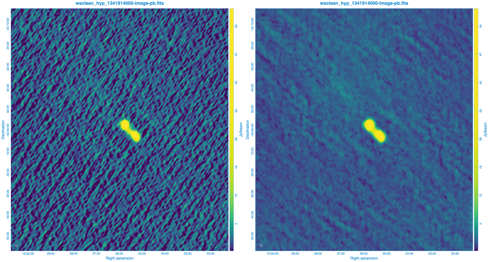

# Workshop Part 1: Configurations

## Downloads

Download demo data (from Pawsey). You should be in the root of the repository.

Setonix note: if you intend to expand this demo further, you can change `$outdir` to `$MYSCRATCH` in `demo/00_env.sh` and `source demo/00_env.sh`

```bash
export outdir=${outdir:-${PWD}/demo/data/}
mkdir -p ${outdir}/1121334536/raw
curl -L -o ${outdir}/1121334536/raw/1121334536_20150719094841_gpubox20_00.fits 'https://projects.pawsey.org.au/mwa-demo/1121334536_20150719094841_gpubox20_00.fits'
mkdir -p ${outdir}/1303134032/raw
curl -L -o ${outdir}/1303134032/raw/1303134032_20210422134116_gpubox20_01.fits 'https://projects.pawsey.org.au/mwa-demo/1303134032_20210422134116_gpubox20_01.fits'
mkdir -p ${outdir}/1341914000/raw
curl -L -o ${outdir}/1341914000/raw/1341914000_20220715095302_ch137_000.fits 'https://projects.pawsey.org.au/mwa-demo/1341914000_20220715095302_ch137_000.fits'
```

Alternatively , you can download the same demo data in your browser [here](https://curtin-my.sharepoint.com/:u:/g/personal/285446d_curtin_edu_au/EQF1Dl93KixAimsD7wi7TcYBjAUs7Y6LO08An5rKSB2cmg?e=nMtGhu) and extract it to the `demo/data` directory.

```bash
unzip -n demo2.zip # -n = do not replace pre-existing files
```

## Running the Workshop

```bash
# (optional) pick a specific obsid:
export obsid=1121334536 # Phase I
export obsid=1303134032 # Phase II Compact
export obsid=1341914000 # Phase II Extended

# query the MWA TAP server with ADQL using the pyvo library
clear; demo/01_tap.sh
# display giant-squid commands to download observations
clear; demo/02_download.sh
# mwalib read observation metadata
demo/03_mwalib.sh
# SSINS find RFI
demo/04_ssins.sh
# Birli preprocess raw files, quality analysis, write uvfits
demo/05_prep.sh
# hyperdrive direction independent calibrate, qa, apply solutions, write measurement set
demo/06_cal.sh
# wsclean cal_ms
demo/07_img.sh
# done
```

You can inspect the images produced in Carta

```bash
carta --top_level_folder . --host 127.0.0.1
```

## Backup Visibilities

If you had some issues with preprocessing or calibration and just want to run wsclean,
you can try these calibrated visibilities.

```bash
export outdir=${outdir:-${PWD}/demo/data/}
# docker run -it --rm -v ${PWD}:${PWD} -w ${PWD} -v${outdir}:${outdir} mwatelescope/mwa-demo:latest
# demo/00_test.sh
rm -rf ${outdir}/1121334536/cal/hyp_cal_1121334536_edg80.ms || mkdir -p ${outdir}/1121334536/cal/
curl -L 'https://projects.pawsey.org.au/mwa-demo/hyp_cal_1121334536_edg80.ms.zip' | tar -C$outdir/1121334536/cal/ -xzf -
export obsid=1121334536
demo/07_img.sh
```

## Quality Analysis

The images for `1341914000` look a bit weird, let's enable calqa flags and try again.



uncomment this line in `demo/06_cal.sh` to apply bad antennas and see how the image changes!

```bash
export cal_bad_ants=""
```

```bash
export obsid=1341914000
rm -rf $outdir/$obsid/{cal,img}
demo/07_img.sh
```

## Configurations

now let's look at the rest of the obsids

```bash
for obsid in 1121334536 1303134032 1341914000; do
  obsid=$obsid demo/07_img.sh || break
done
```


## Adjust imaging parameters

check out demo/07_img.sh to see a full list of parametrs

```bash
for obsid in 1121334536 1303134032 1341914000; do
  obsid=$obsid demo/06_cal.sh || break
done
export ms_list=$(ls -1d ${outdir}/{1121334536,1303134032,1341914000}/cal/hyp_cal_*.ms )
for briggs in 0.0 0.2 0.4 0.6 0.8 1.0; do
  briggs=$briggs imgname=combined/img/wsclean_b$briggs demo/07_img.sh || break;
done

```

## Joint deconvolution

combine them all into a single image

```bash
rm -rf ${outdir}/combined/img/
obsid="combined" cal_ms=$(ls -1d ${outdir}/{1121334536,1303134032,1341914000}/cal/hyp_cal_*.ms ) demo/07_img.sh
```

## Cleanup

clean up outdir to start fresh

```bash
demo/99_cleanup.sh
```
