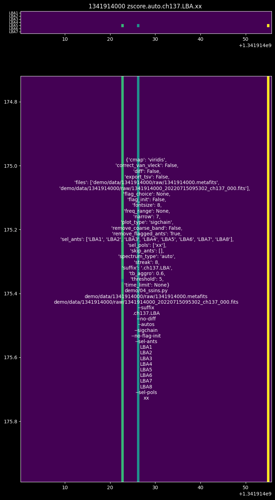
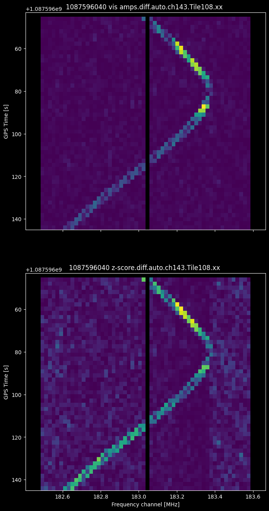
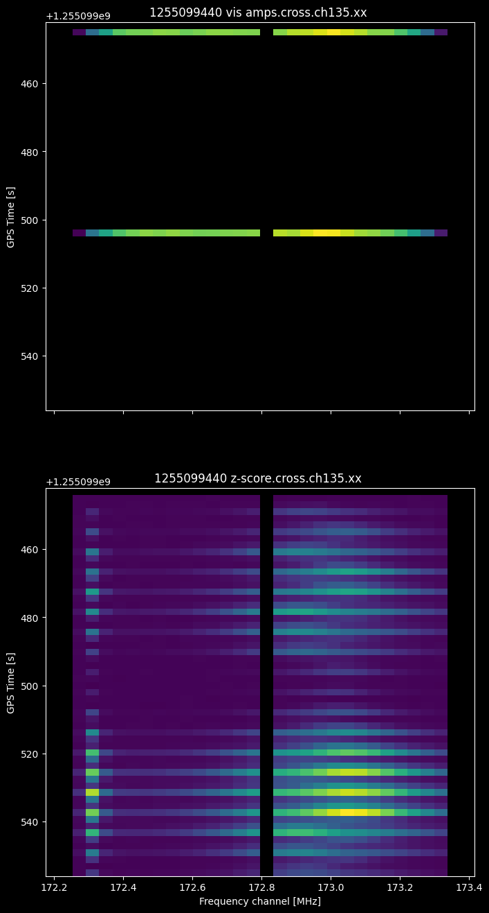

# Workshop part 2: Radio oddities

This is a work in progress.

## Downloads

### from part 1

```bash
mkdir -p ${outdir:-./demo/data}/1341914000/raw
curl -L -o ${outdir:-./demo/data}/1341914000/raw/1341914000_20220715095302_ch137_000.fits 'https://projects.pawsey.org.au/mwa-demo/1341914000_20220715095302_ch137_000.fits'
```

### New

```bash
mkdir -p ${outdir:-demo/data/}1060550888/raw
curl -L -o ${outdir:-demo/data/}1060550888/raw/1060550888_20130814212851_gpubox12_01.fits 'https://projects.pawsey.org.au/birli-test/1060550888_20130814212851_gpubox12_01.fits'
```

## 1341914000 - AOFlagger vs SSINS

Did aoflagger really get all the RFI? you can inspect the raw, preprocessed and calibrated files using ssins.py.

```bash
export obsid=1341914000
export metafits=${outdir:-demo/data/}${obsid}/raw/${obsid}.metafits
export raw="$(ls -1 ${outdir:-demo/data/}${obsid}/raw/${obsid}*.fits)"
export cal_ms="${outdir:-demo/data/}${obsid}/cal/hyp_cal_${obsid}.ms"
python demo/04_ssins.py $metafits $raw
# examine AOFlagger flags from preprocessed uvfits: autocorrelations and cross correlations
demo/05_prep.sh
python demo/04_ssins.py --flags --autos --no-diff ${outdir:-demo/data/}${obsid}/prep/birli_${obsid}*.uvfits
python demo/04_ssins.py --flags --crosses --no-diff ${outdir:-demo/data/}${obsid}/prep/birli_${obsid}*.uvfits
# examine flagged measurement set
demo/06_cal.sh
python demo/04_ssins.py $cal_ms
```


### `1341914000` - Multiple Issues

let's look at the z-scores for each antenna's autocorrelations. To simplify the plot, we'll look at only the long baseline group A initially.

```bash
python demo/04_ssins.py ${outdir:-demo/data/}1341914000/raw/1341914000{.metafits,_20220715095302_ch137_000.fits} --suffix '.ch137.LBA' --no-diff --autos --sigchain --no-flag-init --sel-ants LBA{1..8} --sel-pols xx
```



let's make a note to flag LBA5 for this observation and plot the others

```bash
python demo/04_ssins.py ${outdir:-demo/data/}1341914000/raw/1341914000{.metafits,_20220715095302_ch137_000.fits} --suffix '.ch137' --no-diff --autos --sigchain --skip-ants LBA5 --sel-pols xx --flag-choice original
```


Now we can see three broadband RFI events seen by almost all tiles.

Let's see if we can flag it by asking ssins to look at the autocorrelations

```bash
python demo/04_ssins.py ${outdir:-demo/data/}1341914000/raw/1341914000{.metafits,_20220715095302_ch137_000.fits} --suffix '.ch137' --autos --skip-ants LBA5 --sel-pols yy --flag-choice original
```


It found the start and end of the broadband stripes, but doesn't flag the middle. Let's try cross-correlations.

```bash
python demo/04_ssins.py ${outdir:-demo/data/}1341914000/raw/1341914000{.metafits,_20220715095302_ch137_000.fits} --suffix '.ch137' --crosses --skip-ants LBA5 --sel-pols yy --flag-choice original
```


It seems to have done it! We can also see Starlink RFI at 175MHz now.

```bash
export obsid=1341914000
demo/06_cal.sh
demo/11_allsky.py ${outdir:-demo/data/}${obsid}/cal/hyp_cal_${obsid}.ms --no-diff --crosses --suffix '.175MHz' --sel-pols yy --combine-freq --freq-range 174.99e6 175.01e6
```

<!-- <details>
  <summary>Bonus RFI Workshop content</summary> -->

### `1060550888` channel 143 - Tile104 Whiskers

```bash
python demo/04_ssins.py ${outdir:-demo/data/}1060550888/raw/1060550888{.metafits,_20130814212851_gpubox12_01.fits} --no-diff --autos --sigchain --suffix '.ch143' --sel-ants Tile104 --sel-pols yy
```


does aoflagger see it?

```bash
export obsid=1060550888
demo/05_prep.sh
for suff in Tile{10..11}; do
  python demo/04_ssins.py ${outdir:-demo/data/}1060550888/prep/birli_1060550888_edg80.uvfits --no-diff --crosses --suffix '.ch143.'${suff}X --sel-ants ${suff}{1..8} --flags --flag-choice=original;
done
```

it's visible in receiver 10 but not 11


### `1087596040` channel 134 - 171MHz Snake

```bash
python demo/04_ssins.py ${outdir:-demo/data/}1087596040/raw/1087596040{.metafits,_20140623220027_gpubox21_00.fits} --no-diff --crosses --suffix '.ch134' --sel-pols yy
```


```bash
export obsid=1087596040
demo/06_cal.sh
demo/11_allsky.py ${outdir:-demo/data/}${obsid}/cal/hyp_cal_${obsid}.ms --no-diff --crosses --suffix '.171MHz' --sel-pols yy --combine-freq --freq-range 171.0e6 171.9e6
```

### `1087596040` channel 143 - Tile108 Swoosh

```bash
python demo/04_ssins.py ${outdir:-demo/data/}1087596040/raw/1087596040{.metafits,_20140623220027_gpubox12_00.fits} --suffix '.ch143' --sel-ants Tile108 --sel-pols xx
```



### `1088806248` channel 133 - Snake

```bash
python demo/04_ssins.py ${outdir:-demo/data/}1088806248/raw/1088806248{.metafits,_20140707221035_gpubox22_00.fits} --crosses --suffix '.ch133' --sel-pols xx
```


```bash
export obsid=1088806248
demo/06_cal.sh
demo/11_allsky.py ${outdir:-demo/data/}${obsid}/cal/hyp_cal_${obsid}.ms --no-diff --crosses --suffix '.170MHz' --sel-pols yy --combine-freq --freq-range 169.6e6 170.8e6
```

### `1088806248` channel 145 - Tile055 Discontinuity

```bash
python demo/04_ssins.py ${outdir:-demo/data/}1088806248/raw/1088806248{.metafits,_20140707221035_gpubox10_00.fits} --no-diff --autos --sigchain --suffix '.ch145' --sel-ants Tile055 --sel-pols yy
```


### `1089238040` channel 133 - Snake

```bash
python demo/04_ssins.py ${outdir:-demo/data/}1089238040/raw/1089238040{.metafits,_20140712220707_gpubox22_00.fits} --no-diff --suffix '.ch133' --sel-pols xx
```


```bash
export obsid=1089238040
demo/06_cal.sh
demo/11_allsky.py ${outdir:-demo/data/}${obsid}/cal/hyp_cal_${obsid}.ms --no-diff --crosses --suffix '.170MHz' --sel-pols yy --combine-freq --freq-range 169.8e6 170.8e6
```

### `1090871744` channel 137 - Slow-moving TV

```bash
python demo/04_ssins.py ${outdir:-demo/data/}1090871744/raw/1090871744{.metafits,_20140731195531_gpubox18_00.fits} --no-diff --crosses --suffix '.ch137' --sel-pols xx
```

todo: all-sky images


```bash
export obsid=1090871744
demo/06_cal.sh
demo/11_allsky.py ${outdir:-demo/data/}${obsid}/cal/hyp_cal_${obsid}.ms --no-diff --crosses --suffix '.170MHz' --sel-pols yy --combine-freq
```

### `1094319712` channel 142 - Tile108 Swoosh

```bash
python demo/04_ssins.py ${outdir:-demo/data/}1094319712/raw/1094319712{.metafits,_20140909174139_gpubox13_00.fits} --no-diff --autos --sigchain --suffix '.ch142' --sel-pols xx
```


```bash
python demo/04_ssins.py ${outdir:-demo/data/}1094319712/raw/1094319712{.metafits,_20140909174139_gpubox13_00.fits} --no-diff --crosses --suffix '.ch142' --skip-ants Tile108 --sel-pols xx
```


### `1252516448` channel 142 - Slow-moving TV

```bash
python demo/04_ssins.py ${outdir:-demo/data/}1252516448/raw/1252516448{.metafits,_20190914171353_gpubox13_00.fits} --no-diff --autos --sigchain --suffix '.ch142' --sel-pols xx
```


### `1255099440` channel 135 - Satellite Reflection

```bash
python demo/04_ssins.py ${outdir:-demo/data/}1255099440/raw/1255099440{.metafits,_20191014144345_gpubox20_00.fits}  --no-diff --crosses --suffix '.ch135' --sel-pols xx
```



### `1261482120` channel 177 - Tile027 Sparkle

```bash
python demo/04_ssins.py ${outdir:-demo/data/}1261482120/raw/1261482120{.metafits,_20191227114144_gpubox16_00.fits}  --sigchain --no-diff --suffix '.ch177' --sel-pol xx
```


```bash
python demo/04_ssins.py ${outdir:-demo/data/}1261482120/raw/1261482120{.metafits,_20191227114144_gpubox16_00.fits}  --no-diff --crosses --suffix '.ch177' --skip-ants Tile027 --sel-pol yy
```


### `1324134264` channel 142 - slow TV 181-188MHz

```bash
python demo/04_ssins.py ${outdir:-demo/data/}1324134264/raw/1324134264{.metafits,_20211221150406_ch142_000.fits} --suffix '.ch142.xxyy' --sigchain --no-diff --sel-pols xx yy
```


```bash
python demo/04_ssins.py ${outdir:-demo/data/}1324134264/raw/1324134264{.metafits,_20211221150406_ch142_000.fits} --suffix '.ch142.noT65E23' --crosses --no-diff --skip-ants Tile065 HexE23 --sel-pol xx
```


### `1344506888` channel 137 - Rx07 issue

```bash
python demo/04_ssins.py ${outdir:-demo/data/}1344506888/raw/1344506888{.metafits,_20220814100750_ch137_000.fits} --suffix '.ch137' --sigchain --no-diff
```


```bash
python demo/04_ssins.py ${outdir:-demo/data/}1344506888/raw/1344506888{.metafits,_20220814100750_ch137_000.fits} --suffix '.ch137.noRx7LBAB5' --no-dif  --crosses --skip-ants Tile07{1..8} LBA5 LBB5 --sel-pol xx
```


### `1360791928` - LB E,F,G issue

```bash
python demo/04_ssins.py ${outdir:-demo/data/}1360791928/raw/1360791928{.metafits,_20230218214510_ch137_000.fits} --suffix '.ch137' --sigchain --no-diff --sel-pol xx
```


```bash
python demo/04_ssins.py ${outdir:-demo/data/}1360791928/raw/1360791928{.metafits,_20230218214510_ch137_000.fits} --suffix '.ch137' --sigchain --no-diff --skip-ants LBE{1..8} --sel-pol yy
```


### `1361310560`

```bash
python demo/04_ssins.py ${outdir:-demo/data/}1361310560/raw/1361310560{.metafits,_20230224214902_ch137_000.fits} --suffix '.ch137' --sigchain --no-diff --sel-pol xx
```


```bash
python demo/04_ssins.py ${outdir:-demo/data/}1361310560/raw/1361310560{.metafits,_20230224214902_ch137_000.fits} --suffix '.ch137.noLBE' --sigchain --no-diff --skip-ants LBE{1..8} --sel-pol xx
```


```bash
python demo/04_ssins.py ${outdir:-demo/data/}1361310560/raw/1361310560{.metafits,_20230224214902_ch137_000.fits} --suffix '.ch137.noLBE.noRx7_10_12' --sigchain --no-diff --skip-ants LBE{1..8} Tile07{1..8} Tile10{1..8} Tile12{1..8} --sel-pol yy
```


### `1361397000`

- Tile151 issue
- Rx10 & Rx12 issue

```bash
python demo/04_ssins.py ${outdir:-demo/data/}1361397000/raw/1361397000{.metafits,_20230225214942_ch137_000.fits} --suffix '.ch137' --sigchain --no-diff
```


### `1362519024`

```bash
python demo/04_ssins.py ${outdir:-demo/data/}1362519024/raw/1362519024{.metafits,_20230310213006_ch065_000.fits} --suffix '.ch065' --sigchain --no-diff --sel-pol yy
```


