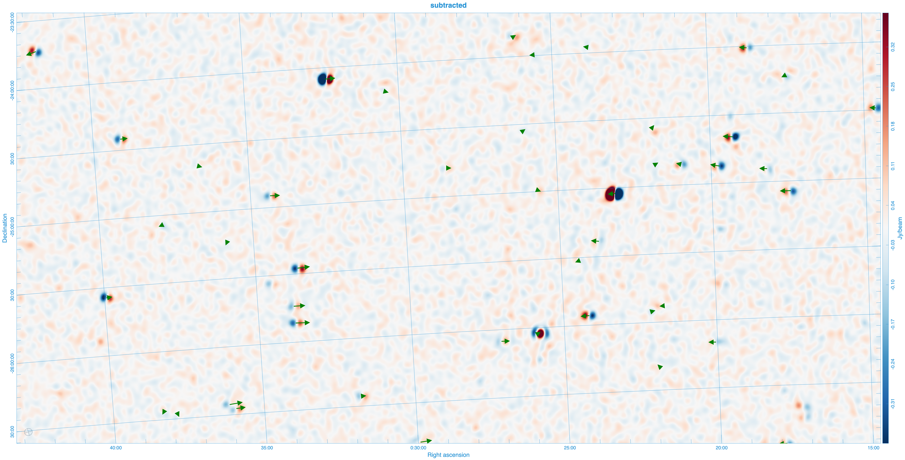

# Ionosphere

In this workshop, we will learn how to subtract a sky model from visibilities that have had
ionospheric corrections applied using [hyperdrive peel](https://mwatelescope.github.io/mwa_hyperdrive/user/peel/intro.html).

We will look at a single timestamp from a 154MHz observation ([1099487728](http://ws.mwatelescope.org/observation/obs/?obsid=1099487728))
of the EoR0 field with known ionospheric activity.


## Environment

add the following to your [demo/00_env.sh](demo/00_env.sh).

```bash
export obsid=1099487728;
# preprocessing settings:
export freqres_khz=40
export timeres_s=4
# calibration settings:
# - just look at timesteps 10-17
export dical_args="--timesteps $(echo {4..5})"
export apply_args="${dical_args}"
export dical_suffix="_t4-5"
# - calibrate (and later subtract) 5000 sources
export num_sources=5000
```

## Downlaod the data

First we need to download the raw files with giant-squid.

```bash
. demo/00_env.sh
giant-squid submit-vis -w $obsid && mkdir -p $outdir/$obsid/raw && giant-squid download -d $_ $obsid;
```

## Image

We will calibrate an image the data as a quick check that it is of decent quality.

Optionally if you have a fast computer and are happy to wait for prettier images, you can add the following to your [demo/00_env.sh](demo/00_env.sh).

```bash
# imaging settings
export briggs=0.5
export size=8000
export scale=0.0035502
export niter=10000000
export nmiter=5
export wsclean_args="-multiscale-gain 0.15 -join-channels -channels-out 4 -save-source-list -fit-spectral-pol 2"
```

```bash
demo/07_img.sh
```

## subtract

add the following to your [demo/00_env.sh](demo/00_env.sh).

```bash
# make `hyperdrive peel` subtract first, instead of peeling.
export peel_prefix="sub_"
export num_passes=1
export num_loops=1
export iono_sources=0
```

and run the following:

```bash
demo/09_peel.sh
demo/07_img.sh
```

## peel

Delete the environment from the previous subtraction step, and replace them with the following:

```bash
# peeling settings:
# - ionosubtract 1000 sources
export iono_sources=1000
export num_passes=3
export num_loops=4
export uvw_max=1000lambda
export uvw_min=50lambda
export iono_time_average=8s
export convergence=0.5
export peel_prefix="iono${iono_sources}_"
```

and run the following:

```bash
demo/09_peel.sh
demo/07_img.sh
```

## Offsets

The ionospheric offsets are stored as a json file in [demo/data/1099487728/peel/hyp_iono1000_1099487728_4s_40kHz_edg80_t4-5_iono.json]

```json
{
  "GLEAM J002549-260211": {
    "alphas": [
      3.419360158702393e-6
    ],
    "betas": [
      1.9228545022138684e-6
    ],
    "gains": [
      1.041485219579928
    ],
    "weighted_catalogue_pos_j2000": {
      "ra": 6.45478200912478,
      "dec": -26.036500930786133
    }
  },
  "GLEAM J002430-292847": {
// ...
  }
}
```

we can plot the offsets in carta by converting these to a ds9 region file.

```bash
python demo/09_peel2reg.py --offsets demo/data/1099487728/peel/hyp_iono1000_1099487728_4s_40kHz_edg80_t4-5_iono.json
```

```txt
J2000;
vector 6.45478200912478d -26.036500930786133d 0.003922931726605167d 29.350935699912213d # text={GLEAM J002549-260211}
vector 6.125635623931912d -29.479946136474613d 0.0035312149135416702d 144.5049406297312d # text={GLEAM J002430-292847}
```


