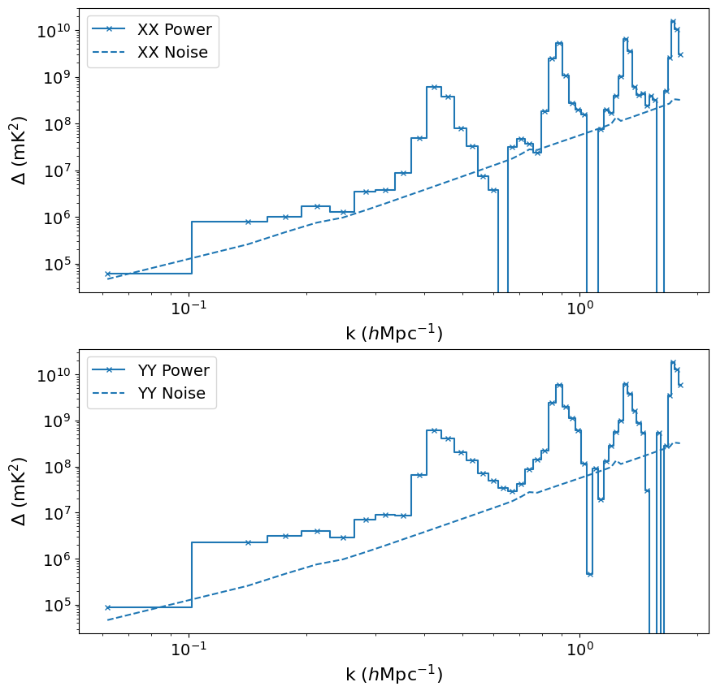
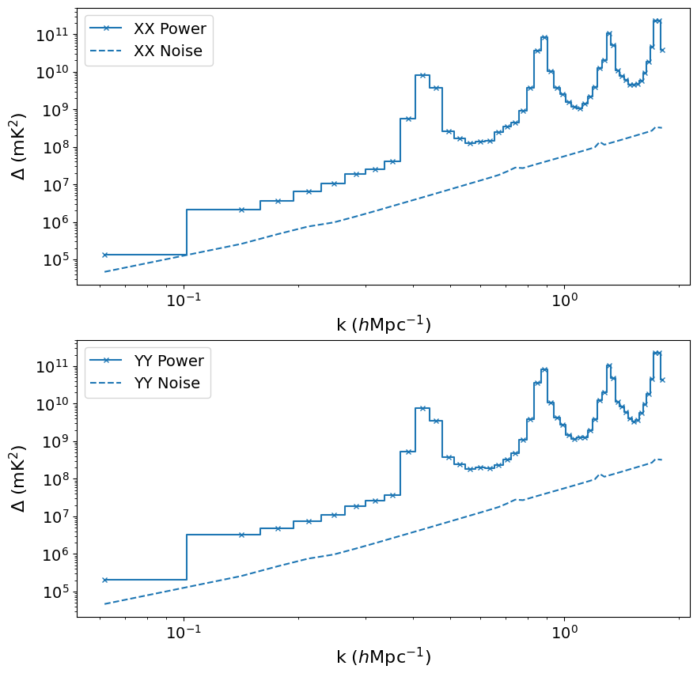
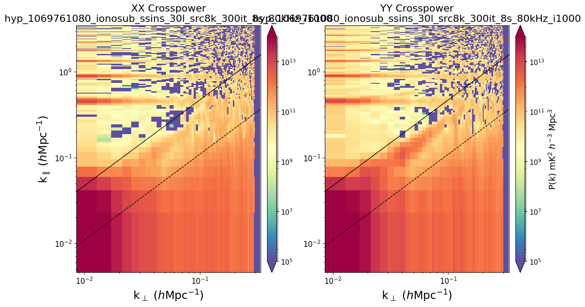
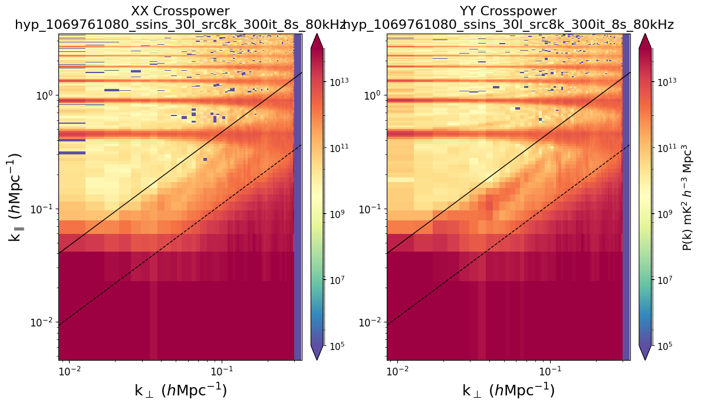
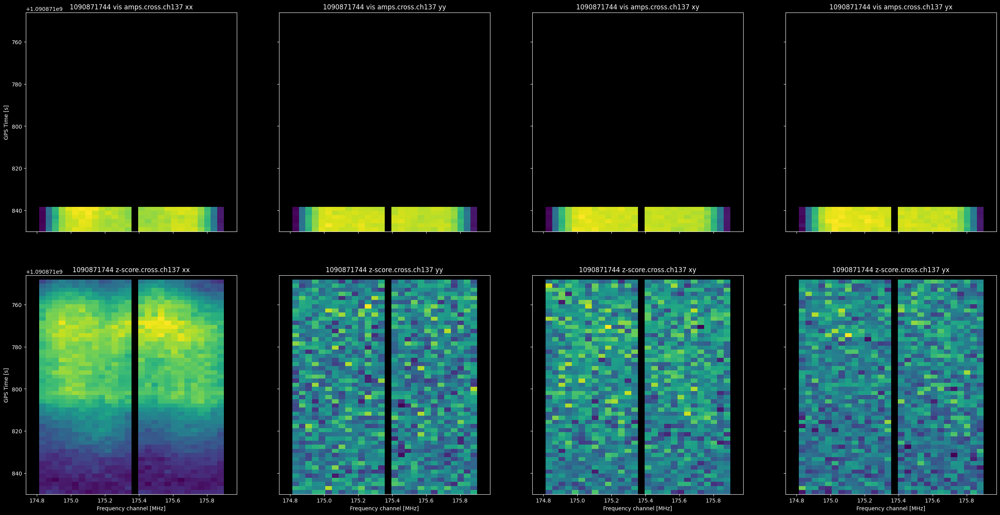
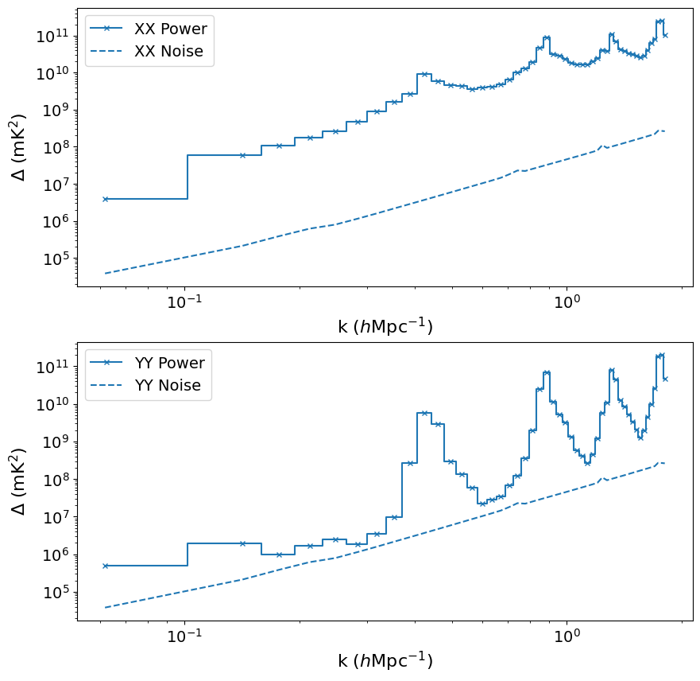
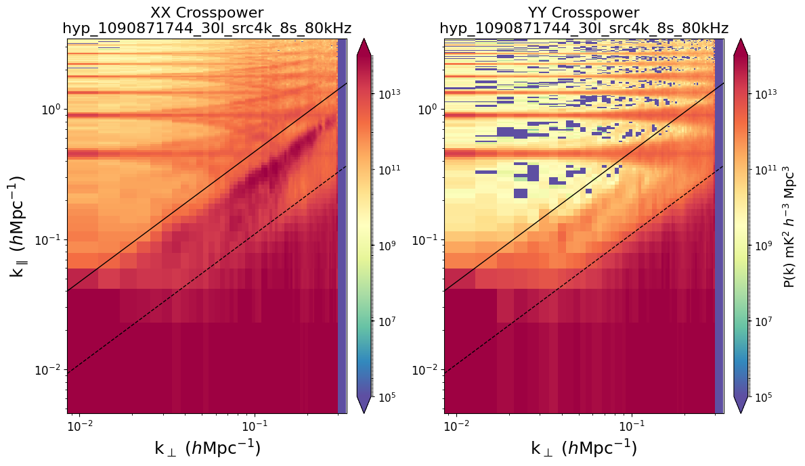

# Workshop Part 5: Power spectrum

This workshop will demonstrate how to use CHIPS for power spectrum estimation.

We will skip the preprocessing and calibration steps, and download data with and without ionospheric correction.

We'll start with a known good observation, and then move on to a more challenging observation.

## Downloads / Setup

run the these before the workshop:

```bash
export obsid=1069761080
export outdir=${outdir:-${PWD}/demo/data/}
mkdir -p ${outdir}/${obsid}/{cal,peel}

# part 1: good data
# ssins flagging and calibration, no ionospheric subtraction
wget -O ${outdir}/1069761080/cal/hyp_1069761080_ssins_30l_src8k_300it_8s_80kHz.uvfits https://projects.pawsey.org.au/high0.uvfits/hyp_1069761080_ssins_30l_src8k_300it_8s_80kHz.uvfits
# ssins flagging, calibration ionospheric subtraction
wget -O ${outdir}/1069761080/peel/hyp_1069761080_ionosub_ssins_30l_src8k_300it_8s_80kHz_i1000.uvfits https://projects.pawsey.org.au/high0.uvfits/hyp_1069761080_ionosub_ssins_30l_src8k_300it_8s_80kHz_i1000.uvfits

# part 2: RFI data, only aoflagger flags
wget -O ${outdir}/1090871744/cal/hyp_1090871744_30l_src4k_8s_80kHz.uvfits https://projects.pawsey.org.au/high0.uvfits/hyp_1090871744_30l_src4k_8s_80kHz.uvfits

# pull the latest mwa-demo image
docker pull mwatelescope/mwa-demo:latest
```

### Quickstart

The quickest way to get started is to run this workshop in a docker container
(or Singularity if you're on HPC).

```bash
# quickstart, Docker
docker run -it --rm -v ${PWD}:${PWD} -w ${PWD} mwatelescope/mwa-demo:main
# or, on singularity
singularity exec -B$PWD -B${outdir:-$PWD} -W$PWD --cleanenv docker://mwatelescope/mwa-demo:latest /bin/bash
```

There are other setup options available in [SETUP.md](SETUP.md), but the baremetal instructions
won't work for running CHIPS on macOS yet.

Note: CHIPS grids take up a lot of disk space.
Each 2GB input file will produce 100GB of grids.

## Known good observation

run the following:

```bash
export obsid=1069761080
export uvf_pattern=${outdir}/${obsid}/cal/hyp_${obsid}_ssins_30l_src8k_300it_8s_80kHz.uvfits
demo/12_chips.sh
export uvf_pattern=${outdir}/${obsid}/peel/hyp_${obsid}_ionosub_ssins_30l_src8k_300it_8s_80kHz_i1000.uvfits
demo/12_chips.sh
```

You can use your favourite data vis tool to plot the TSV files produced.


Or see the plots produced by plotchips_all.py:






## Observation with known RFI

This observation was studied in detail in [workshop 2](WORKSHOP_02.md#1090871744-channel-137---slow-moving-tv) and is known to contain RFI that much stronger
in XX than YY. Because it is slow-moving, it is not detected by AOFlagger or SSINS, but
it is clearly visible in EAVILS.



```bash
export obsid=1090871744
export uvf_pattern=${outdir}/${obsid}/cal/hyp_${obsid}_30l_src4k_8s_80kHz.uvfits
demo/12_chips.sh
```

Clearly there is much more power in XX than YY.




